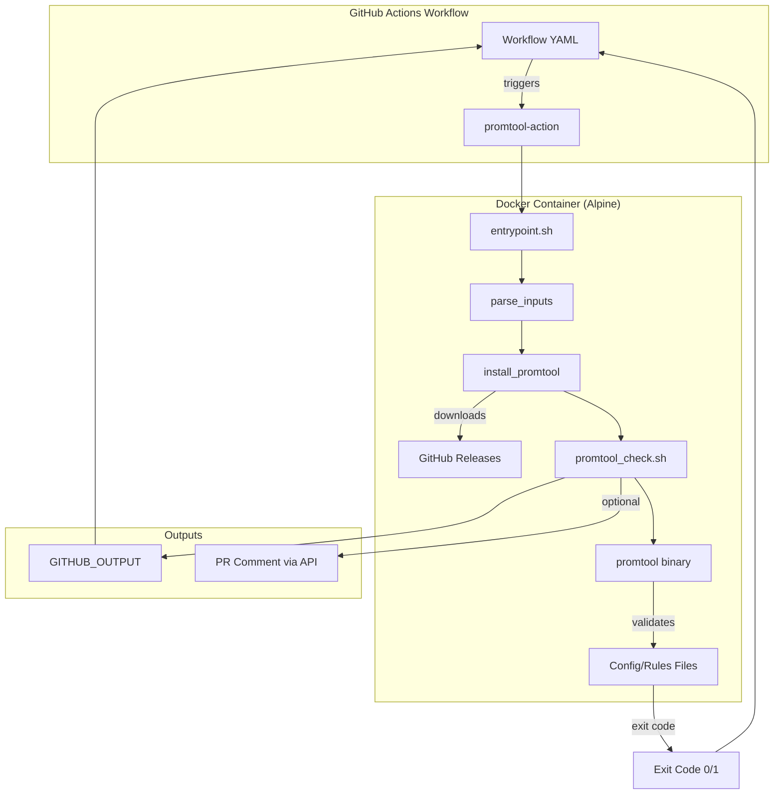
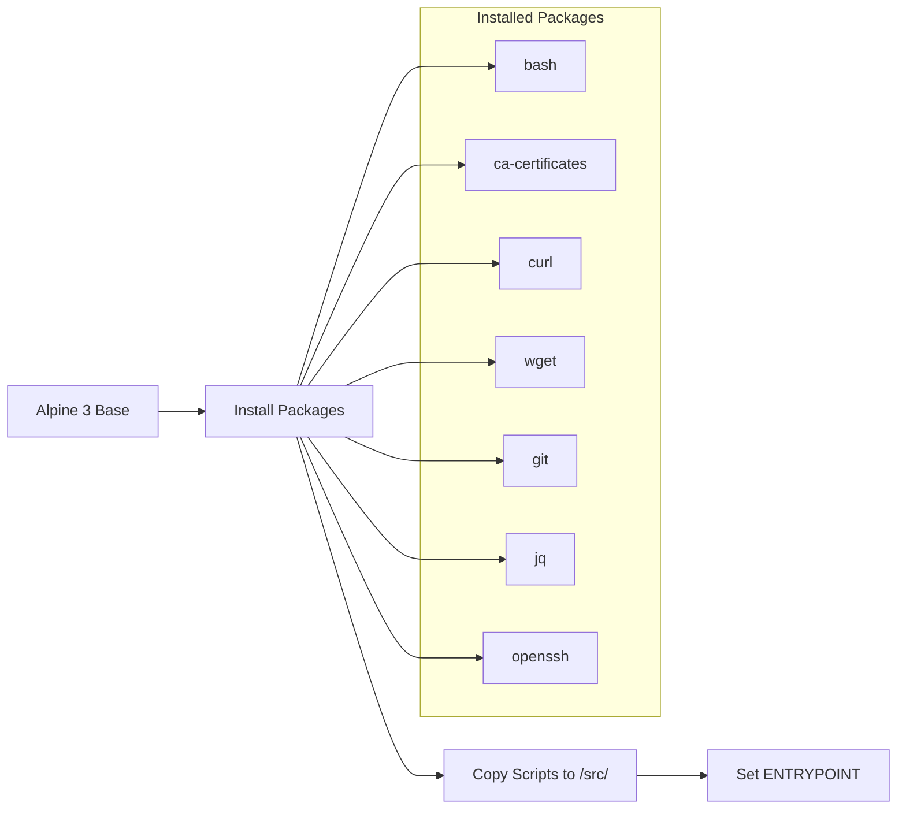
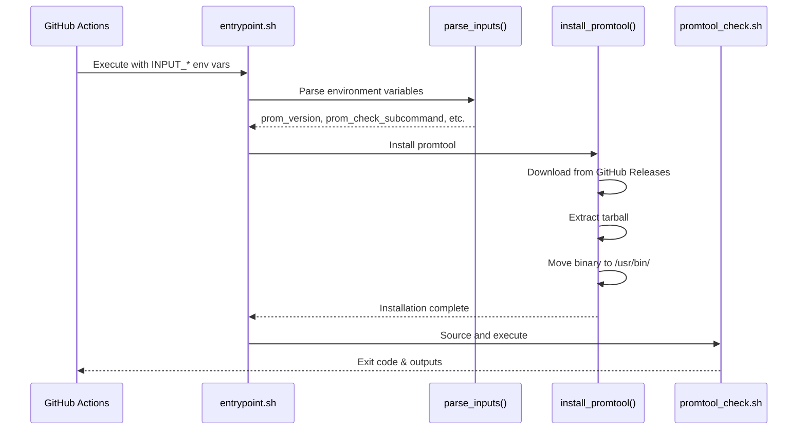
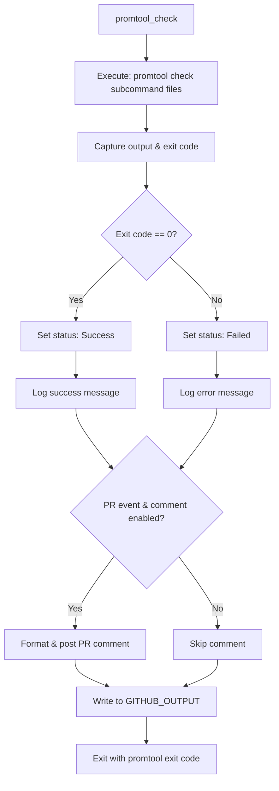
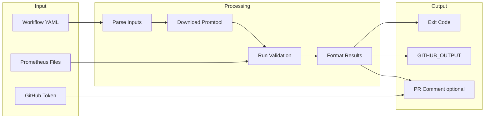
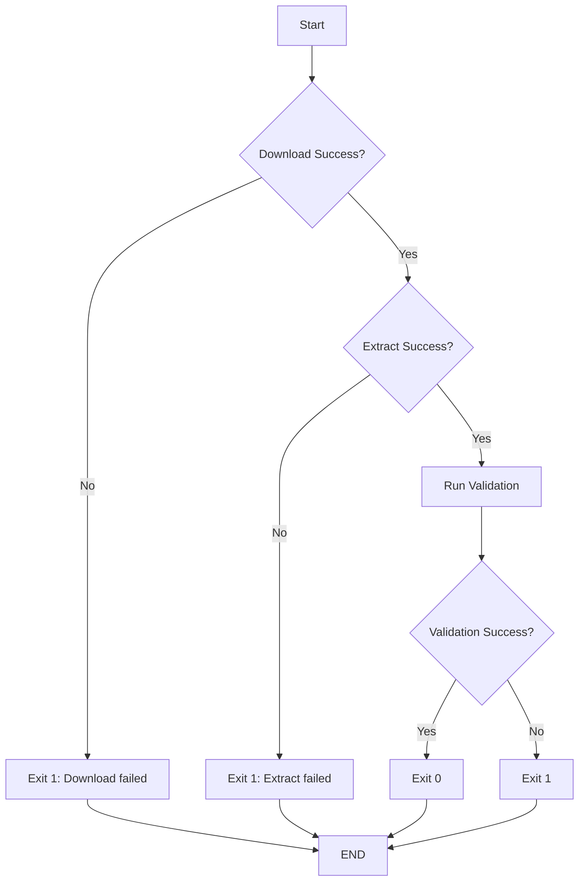
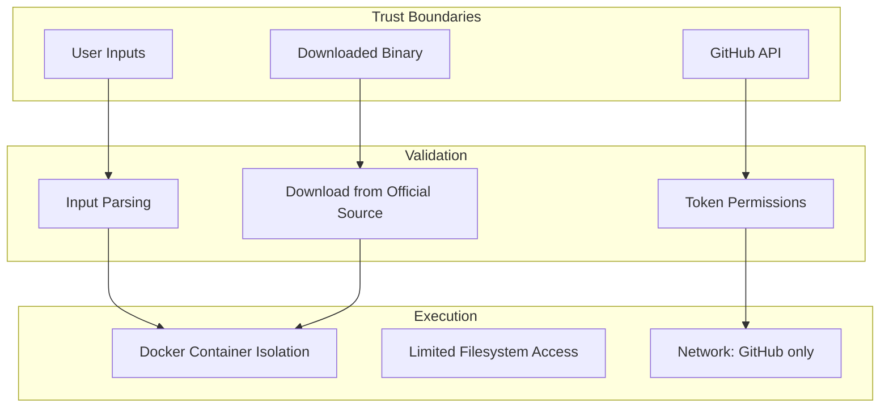
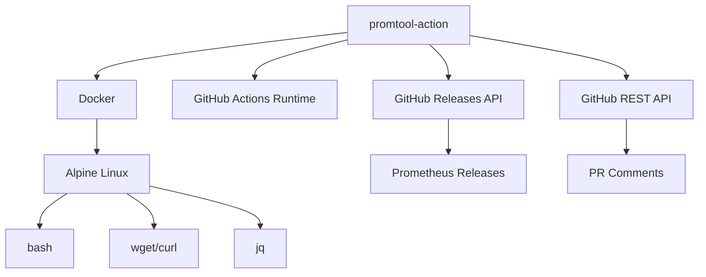

# Architecture Documentation

## Overview

`promtool-action` is a Docker-based GitHub Action that validates Prometheus configuration and rule files. The action downloads the Prometheus binary, extracts the `promtool` utility, runs validation checks, and optionally reports results to pull requests.

## High-Level Architecture



## Component Breakdown

### 1. Action Definition (`action.yml`)

Defines the GitHub Action interface and metadata.

**Inputs:**
- `prom_version` (optional): Prometheus version to download (default: `2.16.0`)
- `prom_check_subcommand` (required): Either `config` or `rules`
- `prom_check_files` (required): File path(s) or glob pattern to validate
- `prom_comment` (optional): Whether to post PR comments (default: `0`/false)

**Outputs:**
- `promtool_output`: Full output from promtool validation

**Runtime:**
- Uses Docker container built from local `Dockerfile`
- Container runs in workflow execution environment

### 2. Docker Container (`Dockerfile`)



**Base Image:** `alpine:3` (lightweight Linux distribution)

**Dependencies:**
- `bash`: Shell for script execution
- `ca-certificates`: SSL/TLS verification
- `curl`: GitHub API communication
- `wget`: Download Prometheus tarball
- `git`: Version control operations (if needed)
- `jq`: JSON processing for API payloads
- `openssh`: SSH operations (if needed)

**Entry Point:** `/src/entrypoint.sh`

### 3. Orchestration Script (`src/entrypoint.sh`)

Main control flow that coordinates the validation process.



**Functions:**

1. **`parse_inputs()`**
   - Reads `INPUT_*` environment variables (set by GitHub Actions)
   - Applies default values if not provided
   - Converts boolean strings (`"true"`, `"1"`) to internal format

2. **`install_promtool()`**
   - Constructs download URL: `https://github.com/prometheus/prometheus/releases/download/v{version}/prometheus-{version}.linux-amd64.tar.gz`
   - Downloads tarball using `wget`
   - Extracts using `tar -zxf`
   - Moves `promtool` binary to `/usr/bin/promtool`
   - Cleans up temporary files

3. **`main()`**
   - Sources `promtool_check.sh`
   - Calls functions in sequence
   - Handles overall execution flow

### 4. Validation Script (`src/promtool_check.sh`)

Executes validation and handles result reporting.



**Function:** `promtool_check()`

**Steps:**

1. **Execute Promtool**
   ```bash
   check_output=$(promtool check ${prom_check_subcommand} ${prom_check_files} 2>&1)
   check_exit_code=${?}
   ```

2. **Determine Result**
   - Exit code `0` → Success
   - Exit code `!= 0` → Failure

3. **Conditional PR Comment**
   ```bash
   if [ "${GITHUB_EVENT_NAME}" == "pull_request" ] && [ "${prom_comment}" == "1" ]
   ```
   - Constructs markdown comment with collapsible details
   - Includes workflow metadata
   - Posts to PR via GitHub API using `GITHUB_ACCESS_TOKEN`

4. **Write Output**
   - Uses multi-line heredoc format for `GITHUB_OUTPUT`
   - Makes `promtool_output` available to subsequent workflow steps

5. **Exit**
   - Exits with promtool's exit code
   - Action succeeds if promtool validation passes
   - Action fails if promtool validation fails

## Data Flow



### Input Data
1. **GitHub Actions Inputs** → Environment variables (`INPUT_*`)
2. **Prometheus Files** → File paths in repository
3. **GitHub Context** → `GITHUB_EVENT_PATH`, `GITHUB_OUTPUT`, etc.
4. **GitHub Token** → `GITHUB_ACCESS_TOKEN` (optional)

### Processing Data
1. **Downloaded Binary** → `/tmp/prometheus-*.tar.gz` → `/usr/bin/promtool`
2. **Validation Output** → Captured stdout/stderr from promtool
3. **Exit Code** → Success/failure indicator

### Output Data
1. **Exit Code** → Determines workflow step success/failure
2. **GITHUB_OUTPUT** → `promtool_output` available to subsequent steps
3. **PR Comment** → Posted to GitHub via API (optional)

## State Management

The action is stateless between invocations. Each execution:

1. Starts fresh container
2. Downloads promtool binary
3. Runs validation
4. Exits

**No persistent state:**
- No caching of promtool binaries
- No state carried between workflow runs
- Each run is independent

## Error Handling



**Error Conditions:**

1. **Download Failure**
   - Promtool version doesn't exist
   - Network issues
   - GitHub releases unavailable
   - **Effect:** Action exits with code 1

2. **Extraction Failure**
   - Corrupted tarball
   - Insufficient disk space
   - **Effect:** Action exits with code 1

3. **Validation Failure**
   - Invalid Prometheus syntax
   - Malformed YAML
   - Invalid PromQL expressions
   - **Effect:** Action exits with code 1, reports errors

4. **API Failure** (PR comments)
   - Invalid token
   - Insufficient permissions
   - Network issues
   - **Effect:** Logged but doesn't fail action

## Security Model



**Security Considerations:**

1. **Container Isolation**: Runs in isolated Docker container
2. **Input Validation**: Minimal (should be improved)
3. **Download Trust**: Downloads from `github.com/prometheus/prometheus`
4. **Token Scope**: Uses `GITHUB_TOKEN` with minimal permissions
5. **Network Access**: Only to GitHub (releases + API)

**See:** `.agents/rules/security.md` for detailed security guidelines.

## Performance Characteristics

**Typical Execution Time:**
1. Container startup: ~1-2 seconds
2. Promtool download: ~3-10 seconds (depends on version/network)
3. Extraction: ~1 second
4. Validation: <1 second for most files
5. PR comment: ~1 second (if enabled)

**Total:** ~5-15 seconds per run

**Optimization Opportunities:**
- Cache promtool binary across runs (requires workflow-level caching)
- Pre-build Docker image with common versions
- Use multi-stage Docker build

## Extensibility

### Adding New Subcommands

Promtool supports additional commands (e.g., `test`, `tsdb`):

```yaml
# In action.yml - add to accepted values (documentation)
prom_check_subcommand:
  description: 'Promtool check command - config|rules|test'
```

```bash
# In scripts - no code changes needed
# Already passes through: promtool check ${prom_check_subcommand} ${prom_check_files}
```

### Adding New Outputs

To expose additional information:

1. Capture in `promtool_check.sh`
2. Write to `$GITHUB_OUTPUT` using heredoc format
3. Document in `action.yml` outputs section

### Supporting Other Architectures

Currently hardcoded to `linux-amd64`:

```bash
url="https://github.com/prometheus/prometheus/releases/download/v${prom_version}/prometheus-${prom_version}.linux-amd64.tar.gz"
```

**To support ARM:**
1. Detect architecture (e.g., via environment variable)
2. Adjust download URL accordingly
3. Test on ARM runners

## Dependencies



**External Dependencies:**
- GitHub Actions infrastructure
- GitHub Releases (for promtool download)
- GitHub REST API (for PR comments)
- Docker runtime
- Alpine package repositories

**Internal Dependencies:**
- `entrypoint.sh` depends on `promtool_check.sh`
- Both scripts depend on environment variables set by GitHub Actions

## Deployment

**Action Published As:**
- GitHub repository: `karancode/promtool-action`
- Tagged releases: `v0.0.1`, etc.

**Usage Pattern:**
```yaml
uses: karancode/promtool-action@v0.0.1
```

**Release Process:**
1. Make changes to scripts/Dockerfile
2. Test locally with Docker
3. Commit and push
4. Create Git tag (e.g., `v0.0.2`)
5. Users reference new tag in workflows

**No Build Process Required:**
- Docker image built on-the-fly by GitHub Actions
- No pre-built images to publish
- Dockerfile in repository is the source of truth

## Future Enhancements

1. **Caching**: Cache promtool binaries between runs
2. **Checksum Verification**: Verify downloaded tarballs
3. **Multi-Architecture**: Support ARM runners
4. **Additional Promtool Commands**: Support `promtool test`, `promtool tsdb`, etc.
5. **Custom Download URLs**: Support enterprise/mirror scenarios
6. **Improved Error Messages**: More actionable failure descriptions
7. **Metrics**: Expose validation statistics (rules checked, errors found)
8. **Parallel Validation**: Check multiple files concurrently
9. **Pre-built Images**: Publish Docker images with common versions

## Troubleshooting

**Common Issues:**

1. **Download Fails**
   - Check Prometheus version exists
   - Verify network connectivity
   - Check GitHub rate limits

2. **Permission Denied**
   - Ensure `GITHUB_ACCESS_TOKEN` provided (if commenting)
   - Check token permissions include `pull_requests: write`

3. **Validation Errors**
   - Review promtool output in logs
   - Test files locally with same promtool version
   - Check Prometheus documentation for syntax

4. **No PR Comment**
   - Verify `prom_comment: true` set
   - Ensure event is `pull_request`
   - Check token permissions

## References

- [GitHub Actions Documentation](https://docs.github.com/en/actions)
- [Prometheus Documentation](https://prometheus.io/docs/)
- [Promtool Command Reference](https://prometheus.io/docs/prometheus/latest/command-line/promtool/)
- [Docker Actions](https://docs.github.com/en/actions/creating-actions/creating-a-docker-container-action)
